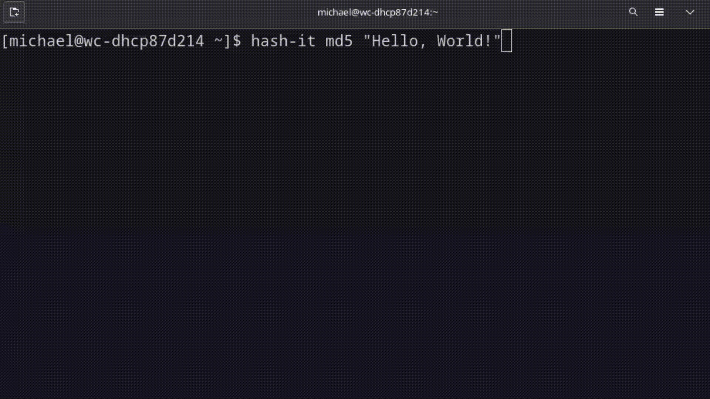
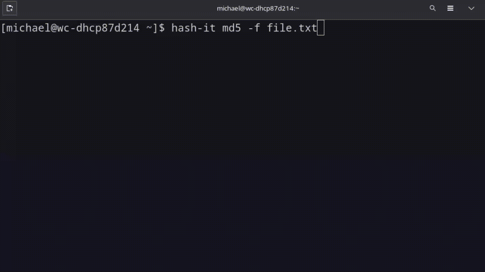
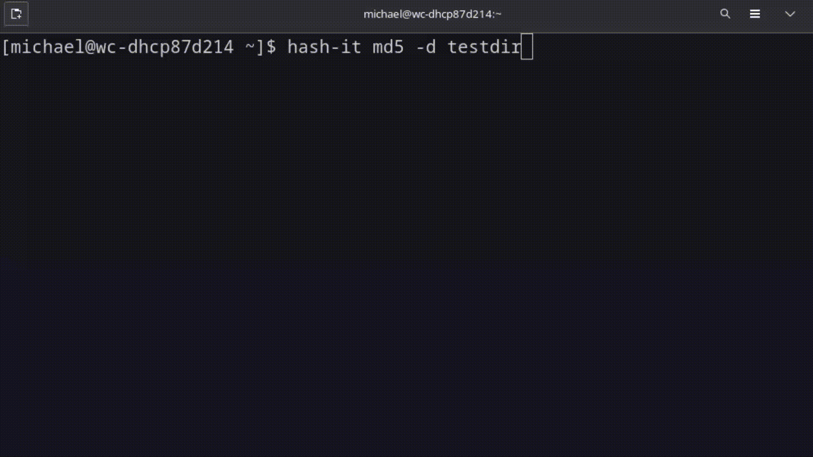

# hash-it

Open source command line tool for hashing files, directories, and strings. I've noticed that a lot of hashing command line tools are missing one or more features that users desire, so I decided to make my own using the [hashlib](https://github.com/python/cpython/blob/main/Lib/hashlib.py) Python module. 

## Installation
Download the `hash-it` file and run the following commands:
* mv ~/Downloads/hash-it /usr/local/bin
* chmod +x hash-it

## Usage
hash-it [ALGORITHM] [OPTIONS] [FILE/DIRECTORY/STRING]

### String hashing: Default

### File hashing: `-f`

### Directory hashing: `-d`

Options:
- `-s` to shorten the hash to the first 10 characters
- `-h` to ignore hidden files and folders
- `-r` to include subfolders within the chosen directory
